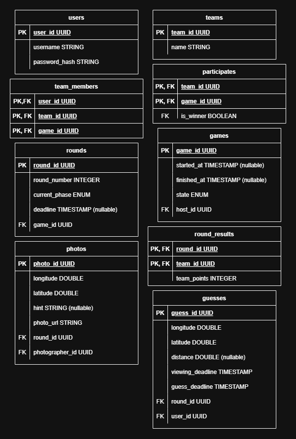

# Datenbankdokumentation

## Schema


## Tabellen
| Tabelle | Beschreibung |
|---|---|
| users | Speichert Benutzerkonten mit Anmeldedaten |
| teams | Repräsentiert Teams, jedes Team hat einen Namen |
| team_members | Verknüpft Spieler mit Teams innerhalb eines Spiels |
| games | Repräsentiert eine Spielsitzung, gehostet von einem Benutzer |
| rounds | Repräsentiert einzelne Runden innerhalb eines Spiels |
| photos | Fotos die von Fotografen während der Upload-Phase aufgenommen werden |
| guesses | Standortschätzungen von Benutzern während einer Runde |
| participates | Verknüpft Teams mit Spielen und speichert den Gewinner |
| round_results | Speichert die Punkte eines Teams pro Runde |

## Enums
**Spielstatus** (`games.state`)
- `lobby` – Spiel wurde erstellt, Spieler können noch beitreten
- `running` – Spiel läuft gerade
- `gameOver` – Spiel ist beendet

**Rundenphase** (`rounds.current_phase`)
- `upload` – Fotografen laden Fotos hoch
- `guess` – Teams sehen das Foto des Gegners und setzen ihren Tipp auf der Karte
- `calculateResults` – Runde ist beendet, Punkte wurden berechnet

## Lokales Setup
1. Docker Desktop starten
2. `.env.example` (enthält vordefinierte lokale Zugangsdaten) zu `.env` kopieren:
```bash
   cp .env.example .env
```
3. Datenbank starten:
```bash
   docker-compose up --build -d
```